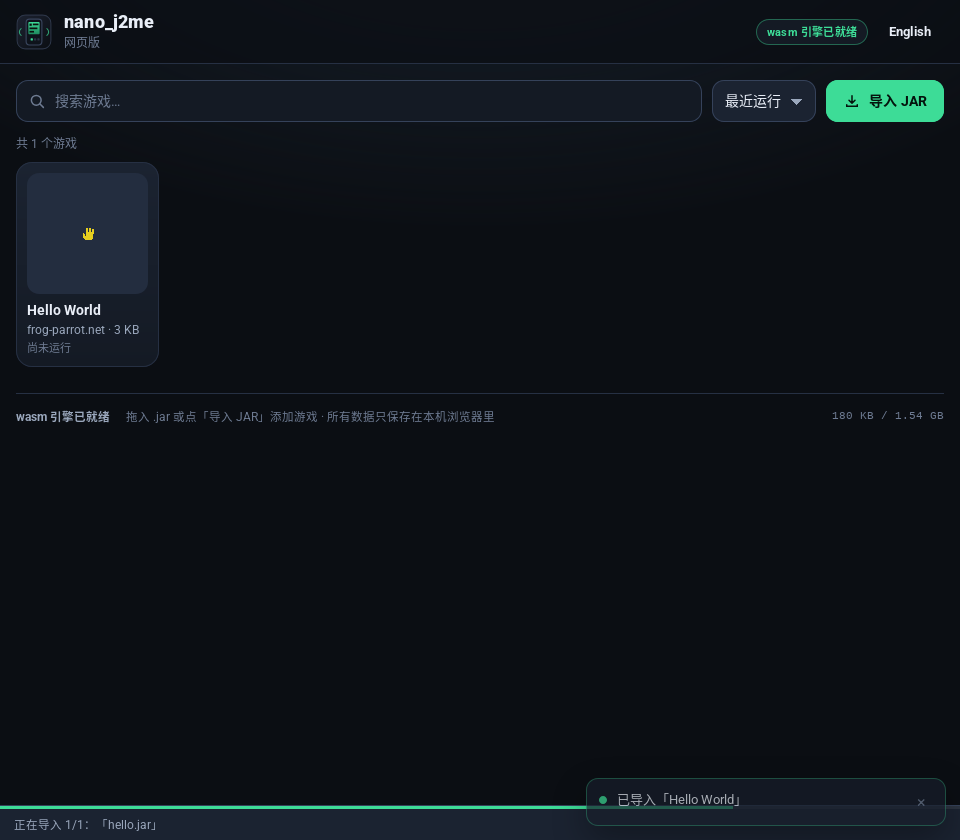
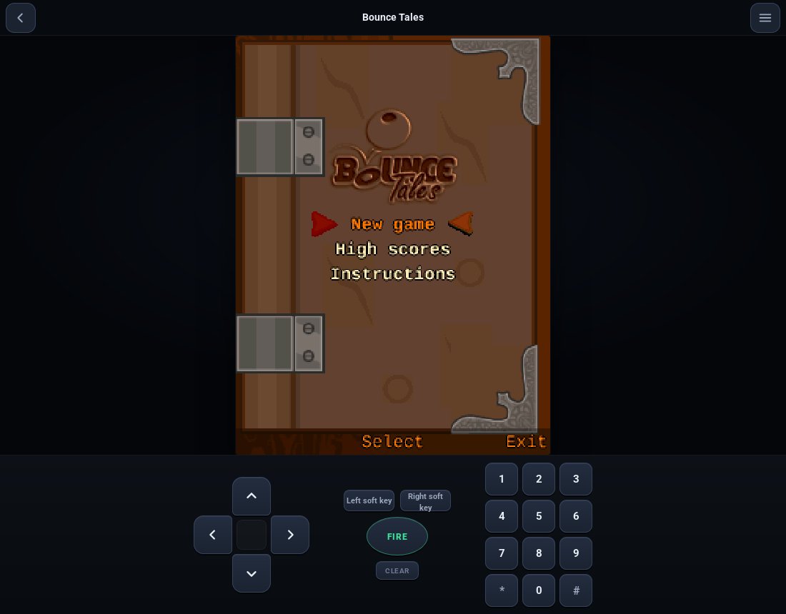
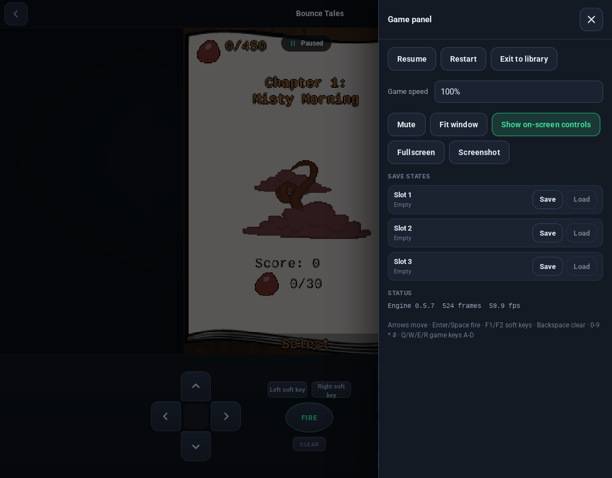

# nano_j2me

[English](README.md) | **简体中文**

[](https://github.com/lucinhu/nano_j2me/releases/latest)
[](LICENSE)
[](docs/VERIFICATION.md)
[](tools/run_sanitized_tests.sh)
[](#设计承诺)

<p align="center">
  
</p>

一个用可移植 C99 编写的 J2ME（CLDC 1.1 / MIDP 2.0）运行时。它让为功能手机写的
`.jar` 游戏跑在 PC、手机、单片机和网页浏览器上——各处是同一个运行时，每个平台只
需要一份很小的 `nj_port` 实现。

- **是整台手机，不是一个子集。** CLDC 1.1 字节码包含 `long`、`double`、异常、
  `synchronized` 和 `jsr`/`ret`；MIDP 2.0 的 LCDUI 与游戏 API；RMS、JSR 75 文件、
  JSR 135 媒体、JSR 184 M3G、Mascot Capsule Micro3D、JSR 82 蓝牙发现和 JSR 256
  传感器。
- **零依赖。** 有 `cc` 和 CMake 就够了。不需要 C++、不需要 JVM、裸机端不需要
  libc，也不需要 zlib/libpng/libjpeg——DEFLATE、PNG、JPEG、GIF、WAV、AMR-NB、
  MP3、MIDI、H.263 和 MPEG-4 Part 2 全部在树内实现。
- **小而可嵌入。** 所有与操作系统相关的代码只是 `nj_port` 的一份实现（约十个
  回调）。运行时不保存任何可写全局状态；同一进程可以共存多个 VM，
  `nj_vm_destroy()` 会返回它释放的字节数。
- **可验证。** `ctest` 里 190 个测试全部通过；400 个真实游戏的兼容性语料中 398 个
  可运行；下面每一条说法都有测试、检查脚本或可回放的记录作为依据。

## 截图

**桌面端（SDL2）**——游戏画面，以及移植层自己绘制的十二键手机键盘。

<p>


</p>

**桌面客户端**——不带 JAR 参数运行时，SDL2 版本会打开一个游戏库窗口：图标和
名称直接来自 MIDlet 清单，支持搜索、最近游玩、收藏、按键重映射和设置页。

<p>


</p>

**网页版（WebAssembly）**——同一个运行时的 Emscripten 模块，外加一个零依赖的
网页外壳：拖入 `.jar` 即玩，键盘或屏幕键盘操作，有声音，每游戏三个存档点，数据
全部保存在本地 IndexedDB。

<p>



</p>

**Android、RetroArch 与 ESP32-S3**——同一份核心分别跑在手机启动器、libretro
核心和真实 240 MHz Xtensa 芯片上。

<p>


</p>

**3D 与视频**——JSR 184 M3G（Minecraft PE）、Mascot Capsule Micro3D，以及一段
自带 AMR-NB 音轨的 MPEG-4 片头视频。

<p>


</p>

## 平台

| 目标 | 提供的内容 |
|---|---|
| **Linux** x86_64 / aarch64 | 命令行运行器和 SDL2 桌面客户端；最低 glibc 2.17 |
| **Windows** x86_64 | `nj2me.exe`（mingw-w64）：命令行运行器加同一个游戏库客户端，UTF-8 路径，已在 Wine 下验证 |
| **Android 5.0+** | 单个 APK，含 arm64-v8a / armeabi-v7a / x86 / x86_64：启动器、浮动键盘、AAudio/OpenSL ES 声音 |
| **Android 2.x 旧版** | ARMv5 `armeabi` 版本，配轻量启动器——见 [docs/ANDROID_LEGACY.md](docs/ANDROID_LEGACY.md) |
| **网页浏览器** | Emscripten 模块加零依赖 ES-module 外壳——见 [docs/WEB.md](docs/WEB.md) |
| **RetroArch / libretro** | Linux（x86_64、aarch64、armv7）和 Android（arm64、armv7、x86_64）原生核心 |
| **ESP32-S3 / ESP32-C3** | ESP-IDF 板上的完整运行时和 MIDlet（VM 需要 PSRAM） |
| **无头（headless）** | 测试套件使用的参考移植层，也适合嵌入和 CI |

Arch Linux 上，AUR 包会安装桌面客户端、静态库和头文件、libretro 核心以及桌面
入口文件：

```sh
yay -S nano-j2me        # 按发行版；nano-j2me-git 跟踪 master
```

## 构建

```sh
cmake -S . -B build -G Ninja
cmake --build build          # 几秒即可，无任何依赖
```

装有 SDL2 时 `build/nj2me` 是 SDL2 桌面客户端，否则是命令行运行器。libretro
核心默认会构建为 `build/libretro/nano_j2me_libretro.so`，可用
`-DNJ_BUILD_LIBRETRO=OFF` 关闭。

运行测试套件前，先生成一次测试数据（需要 JDK 和 Pillow，数据约 1 MB，可随时
重新生成）：

```sh
cmake --build build --target nj_fixtures
ctest --test-dir build --output-on-failure     # 190 个测试
```

测试数据生成是独立步骤：这样普通 `cmake --build` 仍然只是编译，不联网、不需要
Java。加 `-DNJ_GENERATE_FIXTURES=ON` 可以让它自动运行。

## 运行游戏

```sh
build/nj2me game.jar                    # SDL2 客户端，或命令行运行器
build/nj2me                             # 不带 JAR 参数：游戏库窗口
build/nj2me --port headless --dump-frames out/ game.jar
```

键盘：方向键是手机方向键，`Enter`/`Space` 是确认键，`F1`/`F2` 是左右软键，
`Backspace` 是清除键，数字键和 `*`/`#` 对应手机键盘，`F12`/`Tab` 切换屏幕键盘，
`F11` 全屏，`F10` 返回游戏库。手柄可以直接当第一类控制器使用。文字可以用
TrueType 文件绘制，代替内置点阵字体（`--font <ttf>`），坏文件只会告警，不会导致
运行失败。

有些游戏会检查自己运行在哪款手机上，内置设备档案可以像真机一样回答，包括身份
属性：

```sh
build/nj2me --list-devices
build/nj2me --device nokia6230 game.jar
build/nj2me --prop microedition.platform=Nokia6230/05.50 game.jar
```

## 网页版（WebAssembly）

同一个运行时可以用 Emscripten 编译为 WebAssembly。没有服务器端模拟，也不用
pthreads：解释器由 `requestAnimationFrame` 每帧驱动一次，通过虚拟时钟前进，因此
任意静态文件服务器就够用，导入的游戏也永远不会离开浏览器。

```sh
tools/emsdk_setup.sh                    # 只需一次：把 SDK 装进 .local-tools/
tools/build_web.sh                      # -> build/web/（外壳 + nj2me.js + nj2me.wasm）
python3 -m http.server -d build/web 8000
```

打开 `http://localhost:8000/`，拖入 `.jar` 即可游玩。外壳把游戏库、存档文件和
每游戏最多三个存档点保存在 IndexedDB 里。JavaScript⇄C 的接口、持久化目录布局和
限制见 [docs/WEB.md](docs/WEB.md)；验证脚本
（`tools/check_web.sh --all`）会运行 Node API 测试、41 个游戏的语料和真实 Firefox
页面测试。

## 其它构建

```sh
tools/build_android.sh                  # Android APK（标准版）
tools/build_android_legacy.sh           # Android 2.x 旧版 APK
tools/build_windows.sh                  # Windows x86_64 zip（自动下载 SDL2 mingw）
tools/build_libretro_cores.sh --list    # 交叉编译 libretro 核心
```

在 RetroArch 中以 **Mobile - J2ME (nano_j2me)** 加载该核心并选择 `.jar`；操作、
核心选项和存档位置见 [docs/LIBRETRO.md](docs/LIBRETRO.md)。ESP32-S3 见
[docs/PORTING.md](docs/PORTING.md) 和 `tests/embedded/idf/`，该移植层通过
`tools/run_esp_emulator.sh` 在乐鑫的 `esp-emu` 下验证。

可选加速默认关闭：移植层的 GLES2 二维后端和 M3G/Micro3D 片段路径
（`NJ_BUILD_GLES2_ACCEL=ON`，见 [docs/GLES2_BACKEND.md](docs/GLES2_BACKEND.md) 与
[docs/GLES2_3D.md](docs/GLES2_3D.md)），以及 RV32/ARM64 的 JIT 后端
（`NJ_ENABLE_JIT=1`，见 [docs/JIT.md](docs/JIT.md)）。

## 现状

运行时实现的是老游戏真正用到的部分，并且由门禁持续保证这一点：

| 领域 | 状态 |
|---|---|
| CLDC 1.1 VM：类文件解析与链接、解释器、区域堆 + 标记清除 GC、绿色线程与监视器、异常 | 完成 |
| `java.lang`、`java.util`、`java.io`、RMS、JSR 75 `FileConnection` | 完成 |
| MIDP 2.0 LCDUI 与 `lcdui.game`（Canvas、GameCanvas、TextBox、表单、列表、Alert、精灵、瓦片层） | 完成 |
| JSR 135 媒体：音调、MIDI、WAV、AMR-NB、MP3、H.263 与 MPEG-4 Part 2 视频播放器 | 完成 |
| JSR 184 M3G：场景图、`.m3g` 解析、动画、蒙皮网格、相机/光照/雾、软件光栅器 | 完成 |
| Mascot Capsule Micro3D v3：figures、命令列表、仿射/平行/透视投影 | 完成 |
| 网络：通过可移植移植层钩子提供 `http(s)://` 与 `socket://`；蓝牙发现和 JSR 256 传感器 | 在移植层提供无线能力时完成 |
| 软件光栅器、点阵字体、图像解码器、DEFLATE/ZIP | 完成 |
| 执行引擎 | 解释器，另有可选的 RV32/ARM64 JIT |

兼容性是测出来的，不是声称的：[docs/CORPUS.md](docs/CORPUS.md) 的 400 个游戏语料
中 **398 个可运行**，两个失败来自游戏本身（一个截断的 JAR 和一个授权检查）。
各平台的实测结果、测试清单和已知限制见
[docs/PLATFORM_SUPPORT.md](docs/PLATFORM_SUPPORT.md) 与
[docs/VERIFICATION.md](docs/VERIFICATION.md)。

## 设计承诺

- **纯 C99，零依赖。** 不用 C++，不要求 libc（`-DNJ_USE_LIBC=0`），不依赖外部
  解码库。
- **零可写全局状态。** 所有状态都属于一个 `nj_vm`。任何目标文件出现可写符号，
  `tools/check_no_statics.sh` 都会让构建失败。
- **移植只需一个文件。** `include/nj2me/nj_port.h` 就是整个操作系统接口；新平台
  只是一份新的 `nj_port`，不需要改别处。
- **先正确，再求小。** 解释器会处理小型 JVM 常故意跳过的指令——`long`、
  `double`、`synchronized`、`jsr`/`ret`——因为老游戏真的会用到它们。

## 仓库结构

```
include/nj2me/      公共头文件；nj_port.h 是移植契约
src/core/           VM：堆、类加载器、解释器、线程、应用、存档
src/midp/           类库：LCDUI、game、RMS、媒体、M3G、Micro3D、io、util
src/gfx/            软件光栅器、字体、PNG/JPEG/GIF 解码器
src/zip/            DEFLATE 与 ZIP/JAR 读取器
src/port/           headless、SDL2、Android、libretro、ESP32、web、GLES2
src/runner/         把移植层和 MIDlet 接起来的运行器
web/                内置的浏览器外壳（HTML/CSS/ES module）
tests/              断言式测试程序与测试数据
tools/              构建、验证与移植工具
docs/               架构、移植、兼容性、性能文档
```

## 文档

| 文档 | 内容 |
|---|---|
| [docs/ARCHITECTURE.md](docs/ARCHITECTURE.md) | VM、类库和光栅器如何协作 |
| [docs/PORTING.md](docs/PORTING.md) | 把运行时带到新板子或新前端 |
| [docs/WEB.md](docs/WEB.md) | WebAssembly 移植：接口、持久化、验证 |
| [docs/LIBRETRO.md](docs/LIBRETRO.md) | 构建与使用 RetroArch 核心 |
| [docs/COMPATIBILITY.md](docs/COMPATIBILITY.md) | 已实现与未实现的内容，以及游戏如何失败 |
| [docs/CORPUS.md](docs/CORPUS.md) | 400 个游戏的兼容性语料及结果 |
| [docs/PERFORMANCE.md](docs/PERFORMANCE.md) | 各平台的实测性能 |
| [docs/VERIFICATION.md](docs/VERIFICATION.md) | 测试清单：在哪个构建上跑过什么 |

## 许可

运行时代码以 [MIT 许可证](LICENSE) 发布，包含的第三方 MIT 代码见
[第三方代码声明](docs/licenses/third-party-code-MIT.txt)。AMR 回退路径使用
[Apache-2.0 授权的数值数据](docs/AMR_DATA_LICENSES.md)，内置的 Liberation Mono /
思源黑体字形数据保留其 [SIL OFL 1.1 声明](docs/FONT_LICENSES.md)。编解码器的
来源、版本固定与实现说明记录在
[docs/CODEC_PROVENANCE.md](docs/CODEC_PROVENANCE.md)。测试用的游戏 JAR 均为第三
方内容，不在本仓库中分发。
